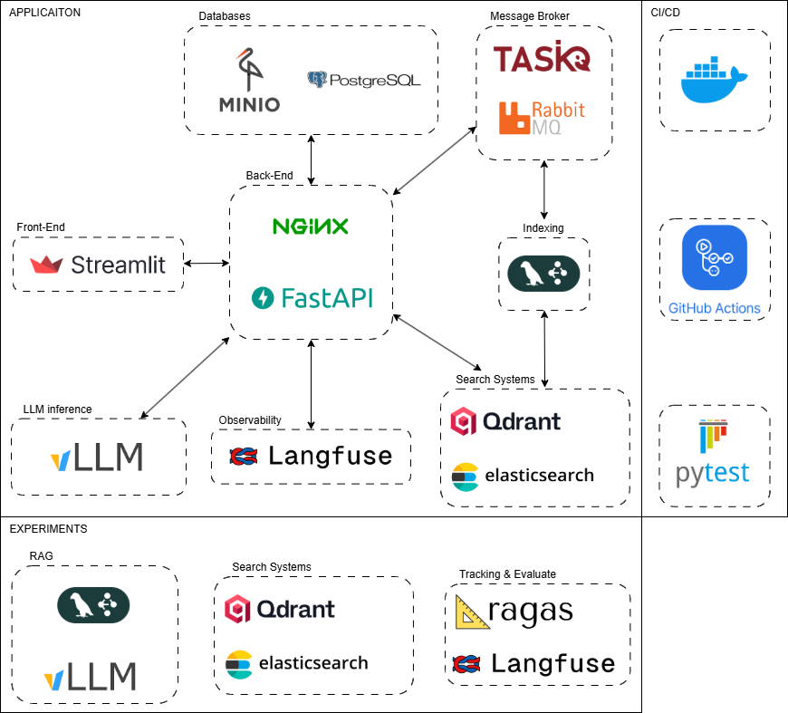

# Анализ и разработка требований

## 1. Введение
### 1.1. Название проекта
### 1.2. Назначение документа
### 1.3. Область применения (scope)
### 1.4. Термины и сокращения (глоссарий)

## 2. Общие сведения о системе

### 2.1. Краткое описание системы

Разрабатываемая система представляет собой локальное веб-приложение, реализующее архитектуру Retrieval-Augmented Generation (RAG) и **ориентированное преимущественно на работу со структурированными PDF-книгами** (учебники, технические книги, издательские материалы, разделённые на главы и разделы).

Ключевая задача системы - **помочь студентам и изучающим дисциплины пользователям создавать конспекты, краткие пересказы и структурированные заметки по главам книг**, а также отвечать на вопросы по содержимому.

При этом система сохраняет возможность задавать произвольные вопросы к загруженному документу вне строгой привязки к главам.

Первая версия системы поддерживает только текстовые PDF-файлы (без OCR) и не включает механизмов авторизации. Приложение рассчитано на одновременную работу нескольких пользователей и обеспечивает корректную обработку запросов на русском и английском языках.

### 2.2. Основные цели и задачи

**Цель проекта** - предоставить инструмент для интеллектуального конспектирования и изучения PDF-книг, позволяющий студентам работать с главами, разделами и ключевыми понятиями, формируя персональные учебные заметки на основе исходного текста.

**Основные задачи системы:**

- выполнение поиска по содержимому PDF-документов с использованием RAG-подхода;
- генерация суммаризаций и конспектов отдельных разделов документов;
- предоставление ответов повышенной точности и полноты, приоритетных над скоростью отклика;
- ведение истории взаимодействий пользователя и использование её для контекстного диалога;
- генерация конспектов и кратких summaries по главам и логическим разделам книги;
- поддержка вопросов вида:
   - «Сделай конспект главы 3»,
   - «Кратко объясни раздел X»,
   - «Выдели ключевые идеи этой главы»;
- сохранение возможности задавать произвольные исследовательские вопросы по всему документу;
- приоритет структурной навигации (главы, разделы) при работе с книгами.
- экспорт ответов и конспектов в формате Markdown (по возможности).

### 2.3. Ограничения и предположения

Система разворачивается в локальной среде и использует одну локальную модель LLM (приоритетно - GPU-ускоренную). Технические характеристики целевого окружения:

- **GPU:** NVIDIA GeForce RTX 5070 Ti (16 ГБ видеопамяти);
- **RAM:** 32 ГБ;
- **SSD:** 2 ТБ.

Система должна работать полностью автономно, без необходимости обращения к внешним API-моделям в первой версии. В будущих версиях допускается добавление выбора модели, включая локальные и облачные варианты.
Для векторного поиска предполагается использование открытых решений, таких как Qdrant (или аналоги по выбору разработчика).

### 2.4. Критерии успешности проекта

Проект считается успешным при выполнении следующих условий:

- обеспечивается высокая точность и релевантность ответов, включая корректную привязку к контексту PDF-документов;
- среднее время отклика на запросы пользователя не превышает **3–8 секунд** при заданной аппаратной конфигурации;
- система корректно обрабатывает PDF-файлы размером до **300–500 МБ** каждый;
- одновременно приложение может использовать до **5–15 пользователей**, без значительной деградации качества работы;
- настроен CI/CD-процесс, включающий автоматическое тестирование ключевых модулей.

## 3. Пользовательские сценарии и кейсы использования

### 3.1. Акторы

В системе определяются следующие акторы:

1. **Пользователь (User)**
   Основной актор, взаимодействующий с приложением. Имеет доступ ко всем пользовательским операциям: загрузка PDF, работа с документами, поиск, чат, просмотр источников, экспорт истории и т. д.

2. **Администратор (Admin)**
   Наследуется от акторa «Пользователь».
   Дополнительные полномочия администратора (определены и включены однозначно):

   - управление локальной моделью (перезапуск, обновление модели при необходимости);
   - управление индексацией (полная переиндексация всех документов);
   - очистка базы данных векторного хранилища;
   - просмотр и очистка системных логов;
   - мониторинг состояния внутренних сервисов (PDF-парсер, векторизация, LLM, очередь сообщений).

3. **Система (System Internal Services)** - внутренний актор, НЕ отображается как внешний на диаграммах.
   Состоит из:
   - сервиса загрузки и парсинга PDF;
   - сервиса векторизации;
   - Qdrant (или выбранного векторного хранилища);
   - LLM-сервиса;
   - очередей обработки (RabbitMQ).
     На диаграммах актором не считается, но фигурирует в описаниях алгоритмов.

Внешних систем не предусмотрено.

### 3.2. Основные use-cases

Ниже приведён полный список пользовательских прецедентов, разделённый по группам. Все UC уникальны, однозначны и пригодны для построения UML Use-Case диаграмм.

#### Группа A: Управление документами

**UC-A1. Загрузка PDF-документа**

- Пользователь загружает один PDF-файл.
- Система проверяет размер, корректность структуры и извлекаемость текста.
- В случае успеха - запускает процесс индексирования.
- Если файл повреждён, слишком большой или не содержит текста - загрузка отменяется.

**UC-A2. Просмотр списка загруженных PDF-документов**

- Отображает пользователю все доступные документы.
- Для первой версии список состоит из одного документа (если загружен); в будущих - из многих.

**UC-A3. Переименование документа**

- Пользователь изменяет имя загруженного PDF.

**UC-A4. Удаление документа**

- Пользователь удаляет загруженный документ.
- Система удаляет данные из хранилища и индекс.

**UC-A5. Повторная индексация документа**

- Пользователь вручную запускает переиндексацию PDF.
- Активно используется администратором в случае ошибок индексации.

**UC-A6. Создание коллекции PDF-документов**
*(стратегический use-case для будущих версий)*

- Пользователь создаёт «коллекцию» - логическую группу документов.
- В текущей версии коллекция содержит максимум один PDF, но интерфейс UC описывается заранее.

#### Группа B: Работа с поиском и вопросами

**UC-B1. Поиск по документу (keyword search)**

- Пользователь вводит поисковый запрос.
- Система возвращает список релевантных текстовых фрагментов с указанием страниц.

**UC-B2. Задание вопроса на основе контекста (RAG)**

- Пользователь задаёт вопрос.
- Система извлекает релевантные фрагменты, формирует prompt и генерирует ответ с помощью LLM.
- Отображается:

  - итоговый ответ,
  - список найденных фрагментов (или ссылки на страницы),
  - ссылки на просмотр PDF на конкретных страницах.

- Система оптимизирована для вопросов, адресованных:
   - конкретной главе книги,
   - отдельному разделу,
   - логически завершённому фрагменту учебного материала.

При наличии структурных метаданных (глава/раздел) они используются при retrieval и формировании ответа, однако пользователь по-прежнему может задавать вопросы без указания структуры.

**UC-B3. Просмотр фрагмента в источнике (PDF Viewer)**

- Пользователь переходит по ссылке на найденный фрагмент.
- Открывается PDF-вьюер на соответствующей странице.

#### Группа C: Чат и история

**UC-C1. Ведение контекстного чата**

- Пользователь задаёт цепочку вопросов.
- История используется как контекст.

**UC-C2. Просмотр истории взаимодействия**

- Пользователь видит свои предыдущие вопросы и ответы.
- Редактирование истории в первом релизе недоступно.

**UC-C3. Экспорт истории чата**

- Пользователь может экспортировать историю в формате Markdown.

#### Группа D: Управление запросами

**UC-D1. Отмена запроса**

- Пользователь отменяет выполнение запроса, если генерация слишком долгая.
- Система обязана корректно остановить процесс.

#### Группа E: Администраторские функции

**UC-E1. Просмотр состояния внутренних сервисов**

- Администратор видит статус: LLM, PDF-парсер, векторизация, очередь сообщений.

**UC-E2. Очистка системных логов**

- Администратор удаляет устаревшие логи.

**UC-E3. Очистка индексов и БД векторного хранилища**

- Полная или частичная очистка данных Qdrant.

**UC-E4. Управление моделью**

- Перезапуск модели, обновление/перезагрузка весов (если требуется).

**UC-E5. Полная переиндексация всех документов**

- Массовая служебная операция.

### 3.3. Альтернативные и исключительные сценарии

Для каждого UC приведены общие исключения:

1. **Ошибка загрузки PDF:**

   - файл слишком большой (выше заданного лимита);
   - повреждён или имеет неверный формат;
   - не содержит текста;
     → Система отменяет загрузку и сообщает пользователю.

2. **Запрос слишком длинный:**

   - пользователь введёт текст больше допустимого лимита;
     → система уведомляет, запрос не обрабатывается.

3. **LLM не отвечает / превышено время генерации:**

   - система уведомляет, предлагает повторить запрос;
   - генерация автоматически отменяется по тайм-ауту.

4. **Векторизация или Qdrant недоступны:**

   - система показывает сообщение об ошибке,
   - поиск и ответы недоступны до восстановления сервиса.

5. **Отмена запроса пользователем:**

   - текущая обработка прекращается, результат не возвращается.

6. **Потеря связи с внутренними сервисами:**

   - операции, требующие индексации/LLM, блокируются;
   - пользователь получает уведомление о технической ошибке.

### 3.4. Диаграммы прецедентов (Use-case diagrams)

1. **Диаграмма пользовательского уровня (User Use-Cases)**
   Включает UC-A1…UC-D1 (кроме E-группы).
   Акторы: Пользователь.

2. **Диаграмма администраторских функций (Admin Use-Cases)**
   Включает UC-E1…UC-E5.
   Акторы: Администратор (наследуется от Пользователя).

3. **Диаграмма высокоуровневой архитектуры прецедентов**
   (опционально)
   – общая схема всех UC, сгруппированных по доменам:
   Документы, Поиск, Чат, Администрирование.

## 4. Функциональные блоки (высокоуровневая структура)

### 4.1. Ингестинг документов

Система обеспечивает загрузку одного или нескольких PDF-файлов, проведение первичной проверки, сохранение в MinIO (локальное S3-хранилище в Docker), постановку задач на индексацию через RabbitMQ, мониторинг статуса обработки и предоставление пользователю информации о прогрессе.

### 4.2. Предобработка и OCR

В первой версии система работает только с текстовыми PDF без OCR. Все механизмы OCR откладываются, но архитектура предусматривает возможность подключения Tesseract/EasyOCR в следующих версиях. Поддерживаемые языки: русский, английский.

### 4.3. Разбиение на чанки / сегментация

Основная стратегия сегментации ориентирована на структуру книги:

- приоритетное разбиение по главам и разделам, извлечённым из оглавления и заголовков PDF;
- внутри главы применяется токенное разбиение (512–768 токенов);
- overlap используется только внутри одного раздела/главы, чтобы не смешивать контексты разных тем;
- если оглавления нет, применяется простое токенное разбиение;
- Chapter Summary - (опционально) краткое содержание целой главы:
   - 500-800 токенов,
   - ключевые идеи,
   - термины,
   - логика изложения

Такая стратегия оптимизирована для генерации конспектов и ответов по учебным главам.

### 4.4. Генерация эмбеддингов

Используется модель из семейства **sentence-transformers**, оптимизированная под GPU 16 ГБ. Базовая конфигурация:
**all-mpnet-base-v2** (универсальная, качественная, легкая).
Вектора нормализуются (L2 norm). Система допускает выбор и сравнение моделей, но не хранит параллельных версий эмбеддингов.

### 4.5. Хранилище векторов (Vector DB)

Основное хранилище - **Qdrant** (лучший выбор под локальный ANN, оптимизирован под CPU). Развёртывается в режиме single-node на локальном SSD. Поддерживаются операции upsert, search, delete, batch-upsert.

### 4.6. Механизм поиска / ранжирования

Используется гибридная стратегия:

- **semantic kNN** - векторный поиск, особенно важно при произвольном вопросе,
- **ElasticSearch** - BM25 поиск по метаданным чанков, особенно при конспектировании глав,
- **reranking** (опционально) через компактный cross-encoder (например *cross-encoder/ms-marco-MiniLM-L-6-v2*). Initial top_k~30 → rerank top_m~8.

### 4.7. RAG-пайплайн

Включает retrieval, reranking, формирование промпта, генерацию ответа и постобработку. Архитектура построена на LangChain/LangGraph с поддержкой асинхронных шагов и работы очередей RabbitMQ.

### 4.8. Модель генерации (LLM) и промпты

Основная LLM:
**Mistral 7B Instruct** (оптимальный баланс качества и скорости под 16 ГБ VRAM; можно заменить на LLaMA/Qwen в будущем).
Поддерживается streaming-режим вывода.
Промпты включают: retrieved context, Chapter Summary (опционально), ссылки на источники (page + offset + chunk-id), перечень фрагментов.

### 4.9. Кэширование и мемоизация

Кэшируются:

- результаты retrieval (semantic search),
- reranked списки,
- финальные ответы LLM.
  Кэш хранится в Redis (docker).

### 4.10. Управление сессиями и контекстом

Система хранит последние 5 сообщений диалога, контекст сериализуется в БД. Сессии поддерживают windowing-режим: только актуальные сообщения отправляются в LLM.

### 4.11. Интерфейсы: веб UI / API / админка

- Пользовательский UI: загрузка PDF, индикатор статуса обработки, чат, просмотр источников, экспорт истории.
- API: REST + WebSocket для стриминга ответов.
- Админ UI: управление моделью, просмотр сервисов, переиндексация, статусы очередей.

### 4.12. Авторизация и аутентификация

В первой версии - только **локальный пароль администратора** для доступа к админке.
Публичная часть работает без авторизации.

### 4.13. Логирование и аудиторский след

Логируются все ключевые события: загрузки, ошибки LLM, индексации, failed jobs, время отклика. Логи структурируются (JSON) и сохраняются в локальные файлы. Предусмотрена очистка логов администратором.

## 5. Детализация функциональных требований

### 5.1. Загрузка документа

#### 5.1.1. Поддерживаемые форматы

PDF (только текстовые, без изображений-текстов и без OCR в v1).

#### 5.1.2. Ограничения по размеру

Максимальный размер: до 400 МБ.

#### 5.1.3. Валидация и уведомления

Проверяется: читаемость, структура, наличие текста, корректность страниц. В случае ошибки - пользователь получает уведомление.

### 5.2. Предобработка и OCR

#### 5.2.1. Поддержка многоязычности

Русский, английский.

#### 5.2.2. Обработка изображений/сканов

В первой версии не реализуется.

#### 5.2.3. Обнаружение макета / таблиц

Не используется в v1, предусмотрено архитектурно.

### 5.3. Чанкинг и аннотации

#### 5.3.1. Алгоритмы разбиения

Основной алгоритм разбиения:

1. Определение структуры книги (главы, разделы) по заголовкам и оглавлению.

2. Токенное разбиение внутри каждого раздела. Чанку задается порядковый номер.

Такой подход обеспечивает корректную работу сценариев конспектирования глав.

#### 5.3.2. Overlap

~64–128 токенов между чанками.

#### 5.3.3. Сохранение метаданных

Для каждого чанка сохраняются:

- страница,
- offset,
- chunk-id,
- номер раздела/главы,
- название разлела,
- порядок чанка в разделе/главе (если глава слишком большая),
- длина чанка.

### 5.4. Эмбеддинги

#### 5.4.1. Модель эмбеддингов

Sentence-Transformers: **all-mpnet-base-v2** (оптимальная для RAG и локального GPU).

#### 5.4.2. Параметры и версия модели

Хранится информация о версии модели, конфигурации и параметрах в settings-файле.

#### 5.4.3. Нормализация и хранение

L2-normalized vectors, float32.

### 5.5. Vector DB

#### 5.5.1. Поддерживаемые операции

Upsert, search, delete, batch-upsert (полностью поддерживаются).

#### 5.5.2. Индексация и настройки поиска

HNSW + quantization (опционально).
Топология: single-node Qdrant.

#### 5.5.3. Репликация и шардирование

В первой версии не используется, допускается добавление.

### 5.6. Retrieval / Reranking

#### 5.6.1. Стратегии поиска

Гибридная: semantic + lexical. При конспектировании преумещественно можно использовать ElasticSearch, как поиск по загаловкам. Векторная - при произвольном вопросе.

#### 5.6.2. Reranking

Используется cross-encoder reranker на top-k результатов.

#### 5.6.3. Ограничение по количеству чанков

top_m = 5-12 (после rerank).

### 5.7. RAG и генерация ответа

#### 5.7.1. Интерфейс к LLM

Async API, поддержка streaming.

#### 5.7.2. Шаблоны промптов

Контекст структурируется в секции:

- вопрос,
- Chapter Summary,
- релевантные фрагменты,
- строгие указания на формат ответа,
- ссылки на источники.

Промпты учитывают учебный сценарий и могут включать инструкции:

- «Сформируй конспект главы»,
- «Объясни материал как для студента»,
- «Выдели ключевые термины и определения».

При этом поддерживается режим свободного вопроса, не ограниченного учебным форматом.

#### 5.7.3. Контроль галлюцинаций

LLM обязана указывать page+offset и chunk-id каждого использованного фрагмента.

#### 5.7.4. Постобработка

Добавление ссылок на источник, форматирование Markdown.

### 5.8. Диалоги и контекст сессии

#### 5.8.1. Хранение истории

5 последних сообщений сохраняются на диск.

#### 5.8.2. Контекстная сегментация

Используется windowing: только релевантная часть истории попадает в LLM.

### 5.9. Интерфейсы и UX

#### 5.9.1. UI

Форма загрузки, индикатор обработки, чат, отображение фрагментов, навигация по PDF.

UI предусматривает:
- отображение структуры книги (главы / разделы);
- быстрые действия:
   - «Сделать конспект главы»,
   - «Краткое резюме раздела»;
- чат для произвольных вопросов поверх учебного материала.

#### 5.9.2. API

REST + WebSocket (stream output).

#### 5.9.3. Админ интерфейс

Просмотр статусов сервисов, журналов, управление моделью и индексацией.

### 5.10. Управление пользователями

#### 5.10.1. Роли

Пользователь, Администратор.

#### 5.10.2. Аутентификация

Только локальный admin password.

### 5.11. Управление данными и метаданными

#### 5.11.1. Метаданные

Сохраняются в MinIO + служебная БД.

#### 5.11.2. Связь чанков и страниц

Каждый чанк содержит прямую ссылку на страницу документа.

## 6. Нефункциональные требования
### 6.1. Производительность
**TL;DR** - по ощущениям.
#### 6.1.1. Целевые задержки (latency) для поиска и генерации
#### 6.1.2. Пропускная способность (throughput)

### 6.2. Точность и качество (quality of answers)
#### 6.2.1. Оценка Embeddings

1. Средняя косинусная схожесть позитивных пар (Positive pair cosine)
   - Определение: средняя cos-sim для пар чанков, явно релевантных (чанк <-> чанк той же главы).
   - Цель: P50 ≥ 0.75, P95 ≥ 0.70.

2. Средняя косинусная схожесть негативных пар (Negative pair cosine)

   - Определение: средняя cos-sim для случайных/нерелевантных пар (разные главы/тематически далекие фрагменты).
   - Цель: P50 ≤ 0.35, P95 ≤ 0.45.

#### 6.2.2. Оценка Retrieval

1. Precision@5
   - Определение: доля релевантных фрагментов в top-5 результатов в тестовом QA-наборе.
   - Цель: ≥ 0.60.

2. Recall@10
   - Определение: доля всех релевантных фрагментов, покрытых топ-10 (важно для completeness при RAG).
   - Цель: ≥ 0.75.

#### 6.2.3. Оценка Reranking (опционально)

1. Δ NDCG@5 (улучшение качества после rerank)
   - Определение: относительное улучшение NDCG@5 по сравнению с исходным ранжированием (vector-only).
   - Цель (приемлемо): ≥ +10%.

2. Precision@5 после rerank
   - Определение: доля релевантных документов в top-5 после reranking.
   - Цель (приемлемо): ≥ 0.70.

#### 6.2.4. Оценка Generation

1. Hallucination rate (human/LLM-judge)
   - Определение: доля утверждений в ответах, которые не подтверждаются использованными источниками при human-eval (или согласно LLM-judge проверке).
   - Цель (приемлемо): ≤ 10% (жёсткая цель), ≤ 15% - допустимый максимум.
   - Процесс: использовать выборочную human-проверку 20–50 Q/A и дополнительно LLM-judge для регрессионов.

2. Source citation rate (coverage ссылок на используемые фрагменты)
   - Определение: доля ответов, где для ключевых фактов указаны page+offset+chunk-id.
   - Цель (приемлемо): ≥ 99% (все ответы, основанные на документе, должны содержать ссылки).

3. Quality score (LLM-judge и/или human) - полезность/понятность
   - Определение: средняя шкала 1–5, где оцениваются полнота, ясность и полезность ответа/конспекта. Можно автоматизировать LLM-judge, сверяя с human выборкой.
   - Цель (приемлемо): среднее ≥ 4.0/5 (LLM-judge) и human avg ≥ 3.8–4.0/5 в выборочных тестах.
   - Дополнительно: при отсутствии достаточной доказательной базы модель должна корректно отказываться в ответе - цель accuracy отказов ≥ 0.90.

## 7. Диаграммы
### 7.1. Архитектура системы

### 7.2. Диаграмма последовательностей (ingest → search → generate)
### 7.3. Диаграмма развертывания (deployment)
### 7.4. Диаграмма компонентов и интеграций
### 7.5. Диаграммы классов / ER-диаграмма данных

## 8. Модели данных и схемы
### 8.1. Формат хранения документов и чанков
### 8.2. Схема метаданных и атрибутов
### 8.3. Контракты API (request/response schemas)
### 8.4. Версионирование схем

## 9. Интеграции и внешние зависимости
### 9.1. Vector DB поставщики (варианты)
### 9.2. OCR/Document parsing сервисы
### 9.3. LLM провайдеры / модели
### 9.4. Аутентификация (IDP)
### 9.5. Мониторинг / логирование / APM
### 9.6. CI/CD и репозитории артефактов

## 10. Тестирование и контроль качества
### 10.1. План тестирования (components)
### 10.2. Unit тесты
### 10.3. Интеграционные тесты
### 10.4. Регрессионные тесты
### 10.5. E2E / acceptance тесты
### 10.6. Нагрузочное тестирование (load & stress)
### 10.7. Тестирование безопасности
### 10.8. Тестирование качества ответов (human evals, automated metrics)
### 10.9. План A/B тестов и метрики успеха

## 11. CI / CD и релизный процесс
### 11.1. Репозитории и ветвление
### 11.2. Pipeline сборки и тестов
### 11.3. Процесс деплоя и отката
### 11.4. Канареечные/blue-green релизы

## 12. Операции и эксплуатация (Ops)
### 12.1. Мониторинг и дашборды (метрики)
### 12.2. Оповещения и эскалации
### 12.3. Резервное копирование и DR (disaster recovery)
### 12.4. Обслуживание моделей и обновление эмбеддингов
### 12.5. Управление инцидентами и пост-мортемы

## 13. Производительность и SLO/SLA
### 13.1. Ключевые метрики (latency, uptime, throughput)
### 13.2. Целевые SLO и SLA для пользователей и внутренних систем
### 13.3. Методы измерения и отчетности

## 14. UX/UI и дизайн
### 14.1. Карты пользовательских потоков (user flows)
### 14.2. Макеты и прототипы (wireframes)
### 14.3. Accessibility / A11 y требования
### 14.4. Локализация и поддержка языков
### 14.5. Поведение при ошибках и сообщения пользователю

## 15. Документация
### 15.1. Пользовательская документация (How-to)
### 15.2. Документация API (OpenAPI/Swagger)
### 15.3. Документация для админов / DevOps
### 15.4. Релизные заметки и changelog

## 16. План внедрения и миграции 
### 16.1. Этапы внедрения (MVP → расширение)
### 16.2. План миграции данных (если есть)
### 16.3. Обучение пользователей и поддержка
